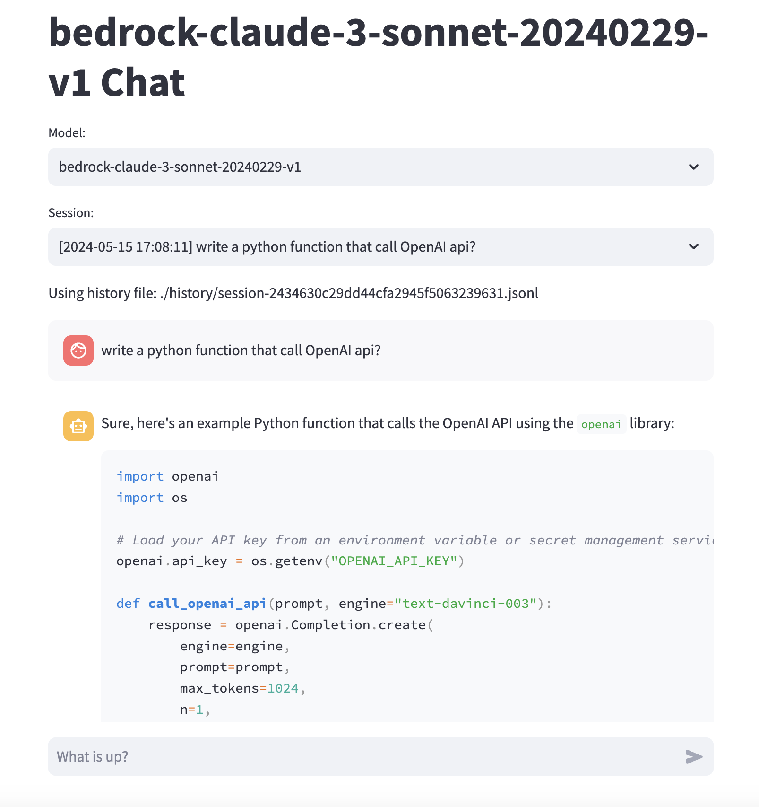

# LLM Chatbot

### Features:
- Switch among multiple models
- Session save and resume



## Installation

Before proceeding, make sure you have [poetry](https://python-poetry.org/docs/#installing-with-the-official-installer) installed. To install this project, follow these steps:

1. Clone the repository.
2. Navigate to the project directory.
3. Install the dependencies using `poetry install`.
4. Configure the models in [config.yaml](./config.yaml) according to your needs.

## Running the Project

To run this project, use the following command:

```bash
poetry run streamlit run ai_chat_streamlit/chat/streamlit_chat.py
```

## Adding More Models

Currently, three types of models are supported: `gpt`, `bedrock`, and `ollama`. However, it's straightforward to add other types of models using the `langchain` API. Refer to [model.py](./ai_chat_streamlit/chat/model.py) and [config.yaml](./config.yaml) for examples on how to add new models.

## License
Apache License
